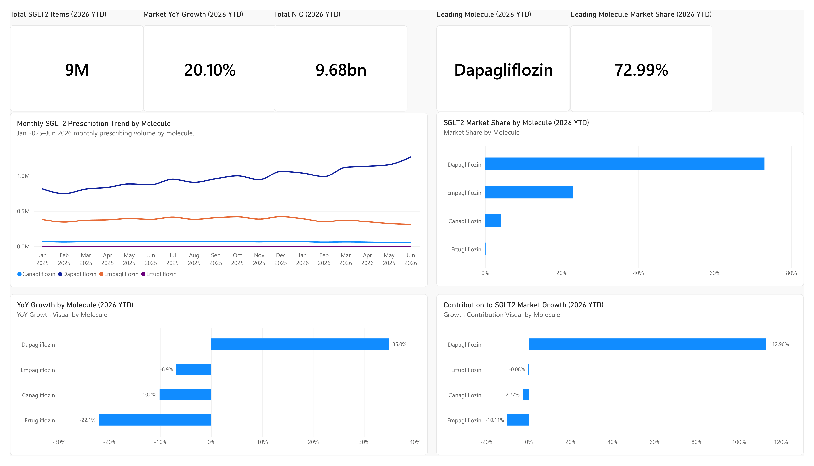
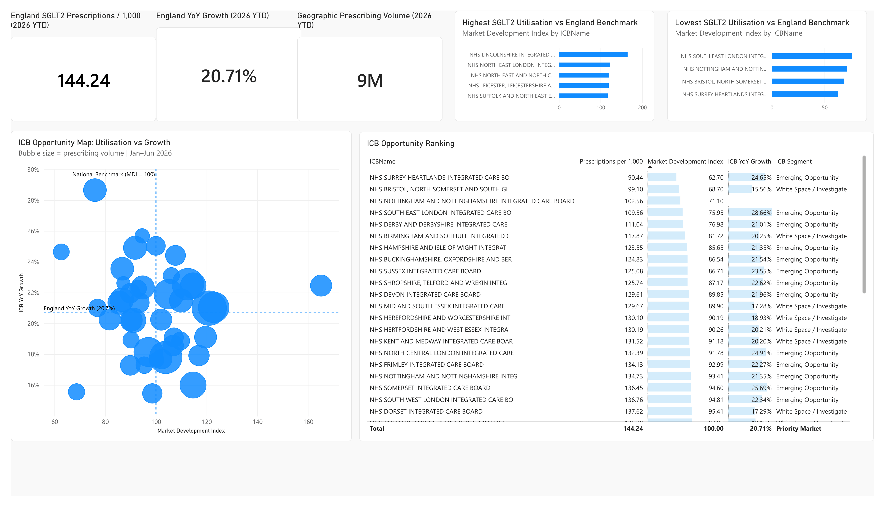
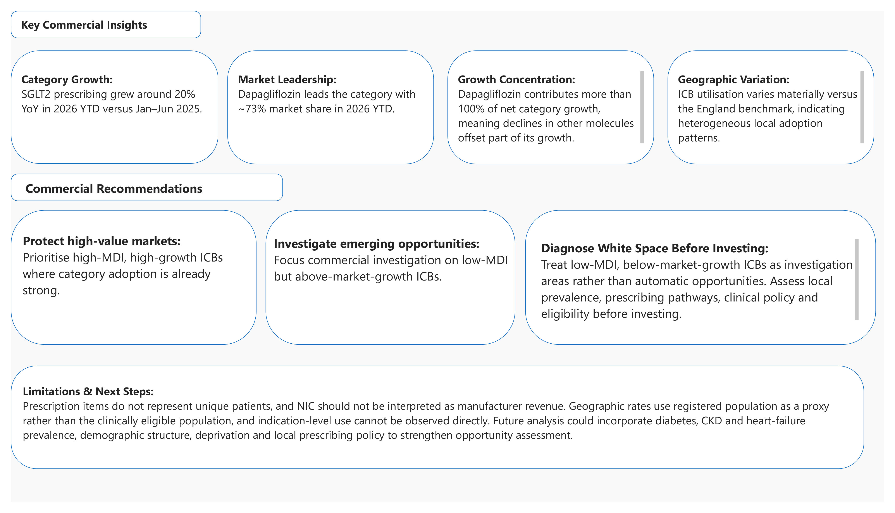
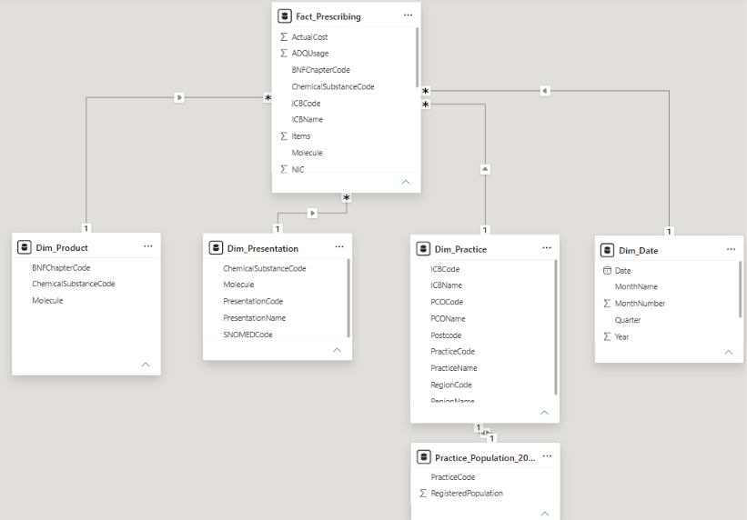

# UK-Pharmaceutical-Commercial-Analytics-SGLT2-Market
Power BI commercial analytics project analysing NHS SGLT2 prescribing trends, competitive market share, growth drivers and geographic opportunity across England.

## Project Overview

This project analyses publicly available NHS prescribing and GP population data to evaluate commercial dynamics within the SGLT2 inhibitor market in England.

The objective was not simply to build a Power BI dashboard, but to transform raw healthcare data into decision-oriented commercial intelligence by assessing:

- Market growth
- Competitive market share
- Product contribution to category growth
- Geographic prescribing variation
- Relative market development across Integrated Care Boards (ICBs)
- Potential commercial opportunity segments
- Analytical limitations and interpretation risks

The analysis covers four SGLT2 molecules:

- Dapagliflozin
- Empagliflozin
- Canagliflozin
- Ertugliflozin

---

## Business Question

> Where are the strongest commercial opportunities within the SGLT2 inhibitor market in England, how is the competitive landscape changing, and which geographic areas show potential for further market development?

The project was designed from the perspective of a pharmaceutical commercial analyst who needs to understand not only what is happening in the market, but also why it matters for decision-making.

---

## Dashboard Pages

### 1. Executive Commercial Overview

The executive dashboard provides a high-level view of market performance, including:

- Total SGLT2 prescription items
- 2026 YTD market growth
- Net Ingredient Cost
- Leading molecule
- Leading molecule market share
- Monthly prescribing trends
- Market share by molecule
- Molecule-level YoY growth
- Contribution to net category growth

### Key Findings

- SGLT2 prescribing increased by approximately **20% YoY in 2026 YTD** compared with Jan–Jun 2025.
- Dapagliflozin represented approximately **73% of prescription-item market share** in 2026 YTD.
- Category growth was highly concentrated in dapagliflozin.
- Dapagliflozin contributed more than **100% of net category growth**, as declines in other molecules partially offset its incremental growth.

---

### 2. Geographic Opportunity Analysis

The geographic analysis evaluates SGLT2 utilisation across Integrated Care Boards.

Absolute prescribing volume was normalised using registered GP population to allow more meaningful geographic comparison.

The primary utilisation metric is:

**Prescriptions per 1,000 Registered Patients**

A **Market Development Index (MDI)** was then created:

MDI = Local Prescriptions per 1,000 / England Prescriptions per 1,000 × 100

Interpretation:

- **MDI > 100** = above national utilisation benchmark
- **MDI = 100** = in line with national benchmark
- **MDI < 100** = below national utilisation benchmark

ICBs were also compared based on year-on-year growth relative to the England growth benchmark.

---

## Geographic Opportunity Segmentation

Each ICB was classified using two dimensions:

- **Market Development Index**
- **ICB YoY Growth**

This created four commercial segments:

| Segment | Interpretation |
|---|---|
| Priority Market | High utilisation and above-market growth |
| Emerging Opportunity | Lower utilisation but above-market growth |
| Mature Market | High utilisation but below-market growth |
| White Space / Investigate | Lower utilisation and below-market growth |

The segmentation framework is intended as an opportunity-screening tool rather than direct evidence of commercial demand.

---

### 3. Commercial Insights, Recommendations & Limitations

The final page translates analytical findings into decision-oriented commercial interpretation.

Key recommendations include:

- Protecting high-value markets where utilisation and growth remain strong
- Investigating lower-utilisation geographies that are growing faster than the national benchmark
- Diagnosing low-growth, low-utilisation markets before assuming they represent commercial whitespace

---

## Data Sources

The project combines publicly available NHS data sources:

- **NHS Business Services Authority — English Prescribing Dataset**
- **NHS Patients Registered at a GP Practice**

### Analysis Period

**January 2025 – June 2026**

For year-on-year comparisons:

**Jan–Jun 2026 is compared with Jan–Jun 2025**

This avoids comparing a partial 2026 period with the full year of 2025.

---

## Data Preparation

Power Query was used to prepare and harmonise the data.

Main transformation steps included:

- Combining monthly prescribing extracts
- Filtering the dataset to the SGLT2 market
- Harmonising schema differences between historical and later prescribing files
- Standardising product and geography fields
- Converting YearMonth fields into valid date values
- Creating reusable dimension tables
- Aggregating GP registered population to practice level
- Matching prescribing practices to population data
- Excluding unmatched or special practice codes from population-normalised geographic measures

Historical prescribing files used slightly different field structures, so a harmonisation layer was created before the datasets were appended.

---

## Data Model

A star-schema approach was used.

### Fact Table

- Fact_Prescribing

### Dimension Tables

- Dim_Date
- Dim_Product
- Dim_Presentation
- Dim_Practice

### Supporting Table

- Practice_Population_202606

The model separates descriptive attributes from transactional prescribing activity and supports reusable DAX measures across different analytical views.

---

## Key Measures

The Power BI model includes measures for:

- Total prescription items
- Total quantity
- Net Ingredient Cost
- Actual Cost
- Year-on-Year Growth
- Market Share
- Market Share Change
- Item Growth
- Growth Contribution
- Registered Population
- Geographic Prescription Items
- Prescriptions per 1,000
- England prescribing benchmark
- Market Development Index
- ICB YoY Growth
- England ICB YoY Growth
- Geographic opportunity segmentation
- Leading molecule
- Leading molecule market share

---

## Commercial Interpretation

The analysis indicates that SGLT2 market growth is not evenly distributed across molecules.

Dapagliflozin holds a dominant prescribing position and accounts for the majority of incremental market expansion.

At geographic level, material variation exists in both prescribing utilisation and growth.

However, lower utilisation should not automatically be interpreted as commercial opportunity.

A lower Market Development Index may reflect:

- Lower disease prevalence
- Different patient demographics
- Local prescribing policy
- Clinical eligibility
- Healthcare pathways
- Local treatment preferences

The geographic model should therefore be used as a screening framework for further commercial investigation.

---

## Limitations

Several limitations should be considered when interpreting the analysis.

### Prescription Items Are Not Patients

Prescription items represent prescribing activity, not unique individuals.

One patient may receive multiple prescriptions.

### NIC Is Not Manufacturer Revenue

Net Ingredient Cost is an NHS prescribing cost measure and should not be interpreted as pharmaceutical sales revenue.

### Volume Share Is Not Revenue Share

Market share in this project is based on prescription items rather than sales value.

### Registered Population Is a Proxy

Registered population improves geographic normalisation but is not equivalent to the clinically eligible SGLT2 patient population.

### Indication Cannot Be Directly Observed

SGLT2 medicines may be prescribed for type 2 diabetes, chronic kidney disease, heart failure, or other eligible indications.

The prescribing dataset does not directly identify indication.

### Organisational Matching Is Imperfect

Some historical, unidentified, or special prescribing codes could not be matched to registered population data.

These records were retained in overall market analysis but excluded from population-normalised geographic rates where no valid denominator was available.

### Correlation Does Not Establish Causality

The analysis describes prescribing patterns but does not establish that any individual policy, guideline, competitive action, or market event caused the observed changes.

---

## Future Development

Potential extensions include incorporating:

- Type 2 diabetes prevalence
- Chronic kidney disease prevalence
- Heart failure prevalence
- Age distribution
- Deprivation
- Local formulary policy
- Clinical pathway information
- Monthly registered population denominators
- Product-level cost-per-item analysis
- Competitive share movement by geography
- Guideline or policy timing analysis

These additions could strengthen the distinction between lower utilisation and genuine commercial opportunity.

---

## Tools & Skills Demonstrated

### Power BI

- Power Query
- DAX
- Data modelling
- Star schema
- Time intelligence
- Ranking
- Conditional filtering
- Reference lines
- Interactive visualisation

### Commercial Analytics

- Market sizing
- Market share analysis
- Competitive benchmarking
- Year-on-year growth
- Growth contribution
- Geographic opportunity analysis
- Market segmentation
- Decision-support reporting

### Data & Information Management

- Multi-source integration
- Schema harmonisation
- Data-quality assessment
- Proxy measurement
- Population normalisation
- Analytical limitations assessment

---

## Repository Structure

sglt2-commercial-analytics/

README.md

images/
- executive_overview.png
- geographic_opportunity.png
- commercial_insights.png
- data_model.png

documentation/
- SGLT2_Commercial_Analytics_Report.pdf

data/
- README.md

Raw NHS prescribing files are not included in this repository due to file size.

The `data` folder documents the public data sources and transformation approach used in the project.

The Power BI `.pbix` source file is available upon request.

---

## Author

**Razaqa Muhammad Hanif Subagyo**

MSc Management of Information Systems and Digital Innovation  
Warwick Business School

GitHub: https://github.com/razaqasubagyo
